# udacity-dcgan-face-generator


# Face Generation
In this project, you'll use generative adversarial networks to generate new images of faces.
### Get the Data
You'll be using two datasets in this project:
- MNIST
- CelebA

Since the celebA dataset is complex and you're doing GANs in a project for the first time, we want you to test your neural network on MNIST before CelebA.  Running the GANs on MNIST will allow you to see how well your model trains sooner.

If you're using [FloydHub](https://www.floydhub.com/), set `data_dir` to "/input" and use the [FloydHub data ID](http://docs.floydhub.com/home/using_datasets/) "R5KrjnANiKVhLWAkpXhNBe".


```python
data_dir = '/data'
!pip install matplotlib==2.0.2
# FloydHub - Use with data ID "R5KrjnANiKVhLWAkpXhNBe"
#data_dir = '/input'


"""
DON'T MODIFY ANYTHING IN THIS CELL
"""
import helper

helper.download_extract('mnist', data_dir)
helper.download_extract('celeba', data_dir)
```

    Requirement already satisfied: matplotlib==2.0.2 in /opt/conda/lib/python3.6/site-packages
    Requirement already satisfied: cycler>=0.10 in /opt/conda/lib/python3.6/site-packages/cycler-0.10.0-py3.6.egg (from matplotlib==2.0.2)
    Requirement already satisfied: pyparsing!=2.0.0,!=2.0.4,!=2.1.2,!=2.1.6,>=1.5.6 in /opt/conda/lib/python3.6/site-packages (from matplotlib==2.0.2)
    Requirement already satisfied: numpy>=1.7.1 in /opt/conda/lib/python3.6/site-packages (from matplotlib==2.0.2)
    Requirement already satisfied: pytz in /opt/conda/lib/python3.6/site-packages (from matplotlib==2.0.2)
    Requirement already satisfied: python-dateutil in /opt/conda/lib/python3.6/site-packages (from matplotlib==2.0.2)
    Requirement already satisfied: six>=1.10 in /opt/conda/lib/python3.6/site-packages (from matplotlib==2.0.2)
    You are using pip version 9.0.1, however version 10.0.1 is available.
    You should consider upgrading via the 'pip install --upgrade pip' command.
    Found mnist Data
    Found celeba Data


## Explore the Data
### MNIST
As you're aware, the [MNIST](http://yann.lecun.com/exdb/mnist/) dataset contains images of handwritten digits. You can view the first number of examples by changing `show_n_images`. 


```python
show_n_images = 25

"""
DON'T MODIFY ANYTHING IN THIS CELL
"""
%matplotlib inline
import os
from glob import glob
from matplotlib import pyplot

mnist_images = helper.get_batch(glob(os.path.join(data_dir, 'mnist/*.jpg'))[:show_n_images], 28, 28, 'L')
pyplot.imshow(helper.images_square_grid(mnist_images, 'L'), cmap='gray')
```


    <matplotlib.image.AxesImage at 0x7f4360fc1b00>


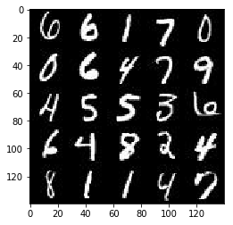


### CelebA
The [CelebFaces Attributes Dataset (CelebA)](http://mmlab.ie.cuhk.edu.hk/projects/CelebA.html) dataset contains over 200,000 celebrity images with annotations.  Since you're going to be generating faces, you won't need the annotations.  You can view the first number of examples by changing `show_n_images`.


```python
show_n_images = 25

"""
DON'T MODIFY ANYTHING IN THIS CELL
"""
mnist_images = helper.get_batch(glob(os.path.join(data_dir, 'img_align_celeba/*.jpg'))[:show_n_images], 28, 28, 'RGB')
pyplot.imshow(helper.images_square_grid(mnist_images, 'RGB'))
```


    <matplotlib.image.AxesImage at 0x7f4360f51630>


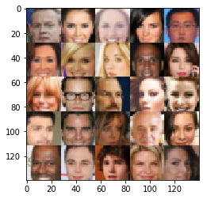


## Preprocess the Data
Since the project's main focus is on building the GANs, we'll preprocess the data for you.  The values of the MNIST and CelebA dataset will be in the range of -0.5 to 0.5 of 28x28 dimensional images.  The CelebA images will be cropped to remove parts of the image that don't include a face, then resized down to 28x28.

The MNIST images are black and white images with a single [color channel](https://en.wikipedia.org/wiki/Channel_(digital_image%29) while the CelebA images have [3 color channels (RGB color channel)](https://en.wikipedia.org/wiki/Channel_(digital_image%29#RGB_Images).
## Build the Neural Network
You'll build the components necessary to build a GANs by implementing the following functions below:
- `model_inputs`
- `discriminator`
- `generator`
- `model_loss`
- `model_opt`
- `train`

### Check the Version of TensorFlow and Access to GPU
This will check to make sure you have the correct version of TensorFlow and access to a GPU


```python
"""
DON'T MODIFY ANYTHING IN THIS CELL
"""
from distutils.version import LooseVersion
import warnings
import tensorflow as tf

# Check TensorFlow Version
assert LooseVersion(tf.__version__) >= LooseVersion('1.0'), 'Please use TensorFlow version 1.0 or newer.  You are using {}'.format(tf.__version__)
print('TensorFlow Version: {}'.format(tf.__version__))

# Check for a GPU
if not tf.test.gpu_device_name():
    warnings.warn('No GPU found. Please use a GPU to train your neural network.')
else:
    print('Default GPU Device: {}'.format(tf.test.gpu_device_name()))
```

    TensorFlow Version: 1.3.0
    Default GPU Device: /gpu:0


### Input
Implement the `model_inputs` function to create TF Placeholders for the Neural Network. It should create the following placeholders:
- Real input images placeholder with rank 4 using `image_width`, `image_height`, and `image_channels`.
- Z input placeholder with rank 2 using `z_dim`.
- Learning rate placeholder with rank 0.

Return the placeholders in the following the tuple (tensor of real input images, tensor of z data)


```python
import problem_unittests as tests

def model_inputs(image_width, image_height, image_channels, z_dim):
    """
    Create the model inputs
    :param image_width: The input image width
    :param image_height: The input image height
    :param image_channels: The number of image channels
    :param z_dim: The dimension of Z
    :return: Tuple of (tensor of real input images, tensor of z data, learning rate)
    """
    # TODO: Implement Function
    real_input_image = tf.placeholder(tf.float32, shape=(None, image_width, image_height, image_channels), name="input_real")
    z_data = tf.placeholder(tf.float32, shape=(None,z_dim), name="input_z")
    learning_rate = tf.placeholder(tf.float32, name="learning_rate")
    return real_input_image, z_data, learning_rate


"""
DON'T MODIFY ANYTHING IN THIS CELL THAT IS BELOW THIS LINE
"""
tests.test_model_inputs(model_inputs)
```

    ERROR:tensorflow:==================================
    Object was never used (type <class 'tensorflow.python.framework.ops.Operation'>):
    <tf.Operation 'assert_rank_2/Assert/Assert' type=Assert>
    If you want to mark it as used call its "mark_used()" method.
    It was originally created here:
    ['File "/opt/conda/lib/python3.6/runpy.py", line 193, in _run_module_as_main\n    "__main__", mod_spec)', 'File "/opt/conda/lib/python3.6/runpy.py", line 85, in _run_code\n    exec(code, run_globals)', 'File "/opt/conda/lib/python3.6/site-packages/ipykernel_launcher.py", line 16, in <module>\n    app.launch_new_instance()', 'File "/opt/conda/lib/python3.6/site-packages/traitlets/config/application.py", line 658, in launch_instance\n    app.start()', 'File "/opt/conda/lib/python3.6/site-packages/ipykernel/kernelapp.py", line 478, in start\n    self.io_loop.start()', 'File "/opt/conda/lib/python3.6/site-packages/zmq/eventloop/ioloop.py", line 177, in start\n    super(ZMQIOLoop, self).start()', 'File "/opt/conda/lib/python3.6/site-packages/tornado/ioloop.py", line 888, in start\n    handler_func(fd_obj, events)', 'File "/opt/conda/lib/python3.6/site-packages/tornado/stack_context.py", line 277, in null_wrapper\n    return fn(*args, **kwargs)', 'File "/opt/conda/lib/python3.6/site-packages/zmq/eventloop/zmqstream.py", line 440, in _handle_events\n    self._handle_recv()', 'File "/opt/conda/lib/python3.6/site-packages/zmq/eventloop/zmqstream.py", line 472, in _handle_recv\n    self._run_callback(callback, msg)', 'File "/opt/conda/lib/python3.6/site-packages/zmq/eventloop/zmqstream.py", line 414, in _run_callback\n    callback(*args, **kwargs)', 'File "/opt/conda/lib/python3.6/site-packages/tornado/stack_context.py", line 277, in null_wrapper\n    return fn(*args, **kwargs)', 'File "/opt/conda/lib/python3.6/site-packages/ipykernel/kernelbase.py", line 281, in dispatcher\n    return self.dispatch_shell(stream, msg)', 'File "/opt/conda/lib/python3.6/site-packages/ipykernel/kernelbase.py", line 232, in dispatch_shell\n    handler(stream, idents, msg)', 'File "/opt/conda/lib/python3.6/site-packages/ipykernel/kernelbase.py", line 397, in execute_request\n    user_expressions, allow_stdin)', 'File "/opt/conda/lib/python3.6/site-packages/ipykernel/ipkernel.py", line 208, in do_execute\n    res = shell.run_cell(code, store_history=store_history, silent=silent)', 'File "/opt/conda/lib/python3.6/site-packages/ipykernel/zmqshell.py", line 533, in run_cell\n    return super(ZMQInteractiveShell, self).run_cell(*args, **kwargs)', 'File "/opt/conda/lib/python3.6/site-packages/IPython/core/interactiveshell.py", line 2728, in run_cell\n    interactivity=interactivity, compiler=compiler, result=result)', 'File "/opt/conda/lib/python3.6/site-packages/IPython/core/interactiveshell.py", line 2856, in run_ast_nodes\n    if self.run_code(code, result):', 'File "/opt/conda/lib/python3.6/site-packages/IPython/core/interactiveshell.py", line 2910, in run_code\n    exec(code_obj, self.user_global_ns, self.user_ns)', 'File "<ipython-input-39-194c419aada8>", line 22, in <module>\n    tests.test_model_inputs(model_inputs)', 'File "/home/workspace/face_generation/problem_unittests.py", line 12, in func_wrapper\n    result = func(*args)', 'File "/home/workspace/face_generation/problem_unittests.py", line 68, in test_model_inputs\n    _check_input(learn_rate, [], \'Learning Rate\')', 'File "/home/workspace/face_generation/problem_unittests.py", line 34, in _check_input\n    _assert_tensor_shape(tensor, shape, \'Real Input\')', 'File "/home/workspace/face_generation/problem_unittests.py", line 20, in _assert_tensor_shape\n    assert tf.assert_rank(tensor, len(shape), message=\'{} has wrong rank\'.format(display_name))', 'File "/opt/conda/lib/python3.6/site-packages/tensorflow/python/ops/check_ops.py", line 617, in assert_rank\n    dynamic_condition, data, summarize)', 'File "/opt/conda/lib/python3.6/site-packages/tensorflow/python/ops/check_ops.py", line 571, in _assert_rank_condition\n    return control_flow_ops.Assert(condition, data, summarize=summarize)', 'File "/opt/conda/lib/python3.6/site-packages/tensorflow/python/util/tf_should_use.py", line 175, in wrapped\n    return _add_should_use_warning(fn(*args, **kwargs))', 'File "/opt/conda/lib/python3.6/site-packages/tensorflow/python/util/tf_should_use.py", line 144, in _add_should_use_warning\n    wrapped = TFShouldUseWarningWrapper(x)', 'File "/opt/conda/lib/python3.6/site-packages/tensorflow/python/util/tf_should_use.py", line 101, in __init__\n    stack = [s.strip() for s in traceback.format_stack()]']
    ==================================
    Tests Passed


### Discriminator
Implement `discriminator` to create a discriminator neural network that discriminates on `images`.  This function should be able to reuse the variables in the neural network.  Use [`tf.variable_scope`](https://www.tensorflow.org/api_docs/python/tf/variable_scope) with a scope name of "discriminator" to allow the variables to be reused.  The function should return a tuple of (tensor output of the discriminator, tensor logits of the discriminator).


```python
def generateDiscriminatorLayer(x, size, alpha=0.2, kernel=5, strides=2, padding='same'):
    x1 = tf.layers.conv2d(x, size, kernel, strides=2, padding='same')
    x1 = tf.layers.batch_normalization(x1, training=True)
    lRelu = tf.maximum(alpha * x1, x1)
    return lRelu

def discriminator(images, reuse=False):
    """
    Create the discriminator network
    :param images: Tensor of input image(s)
    :param reuse: Boolean if the weights should be reused
    :return: Tuple of (tensor output of the discriminator, tensor logits of the discriminator)
    """
    # TODO: Implement Function
    with tf.variable_scope('discriminator', reuse=reuse):
        alpha = 0.02
        # Input layer is 28x28x3 or 28x28x1
        x = tf.layers.conv2d(images, 64, 5, strides=2, padding='same')
        x = tf.maximum(alpha * x, x)
        # 14 x 14 x 64
        
        x2 = generateDiscriminatorLayer(x, 128, alpha)
        # 7 x 7 x 128
        
        x3 = generateDiscriminatorLayer(x2, 256, alpha)
        # 4 x 4 x 256
        
        flaten = tf.reshape(x3, (-1, 4*4*256))
        logits = tf.layers.dense(flaten, 1)
        out = tf.sigmoid(logits)
        
        return out, logits


"""
DON'T MODIFY ANYTHING IN THIS CELL THAT IS BELOW THIS LINE
"""
tests.test_discriminator(discriminator, tf)
```

    Tests Passed


### Generator
Implement `generator` to generate an image using `z`. This function should be able to reuse the variables in the neural network.  Use [`tf.variable_scope`](https://www.tensorflow.org/api_docs/python/tf/variable_scope) with a scope name of "generator" to allow the variables to be reused. The function should return the generated 28 x 28 x `out_channel_dim` images.


```python
def generateGeneratorLayer(x, size, alpha=0.2, training=True, kernel=5, strides=2, padding='same'):
    x2 = tf.layers.conv2d_transpose(x, size, kernel, strides=strides, padding=padding)
    x2 = tf.layers.batch_normalization(x2, training=training)
    x2 = tf.maximum(alpha * x2, x2)
    return x2

def generator(z, out_channel_dim, is_train=True):
    """
    Create the generator network
    :param z: Input z
    :param out_channel_dim: The number of channels in the output image
    :param is_train: Boolean if generator is being used for training
    :return: The tensor output of the generator
    """
    # TODO: Implement Function
    with tf.variable_scope('generator', reuse=not is_train):
        alpha= 0.02
        # First fully connected layer
        x = tf.layers.dense(z, 4*4*1024)
        x = tf.reshape(x, (-1, 4, 4, 1024))
        x = tf.layers.batch_normalization(x, training=is_train)
        x = tf.maximum(alpha * x, x)
        # 4 x 4 x 1024
        
        x2 = generateGeneratorLayer(x, 512, alpha, training=is_train, kernel=4, strides=1, padding='valid')
        # 7 x 7 x 512
        
        x3 = generateGeneratorLayer(x2, 256, alpha, training=is_train)
        # 14 x 14 x 256
        
        # Output layer, 28 x 28 x out_channel_dim
        logits = tf.layers.conv2d_transpose(x3, out_channel_dim, 5, strides=2, padding='same')
        # 28 x 28 x out_channel_dim
        
        out = tf.tanh(logits)
        return out


"""
DON'T MODIFY ANYTHING IN THIS CELL THAT IS BELOW THIS LINE
"""
tests.test_generator(generator, tf)
```

    Tests Passed


### Loss
Implement `model_loss` to build the GANs for training and calculate the loss.  The function should return a tuple of (discriminator loss, generator loss).  Use the following functions you implemented:
- `discriminator(images, reuse=False)`
- `generator(z, out_channel_dim, is_train=True)`


```python
def model_loss(input_real, input_z, out_channel_dim):
    """
    Get the loss for the discriminator and generator
    :param input_real: Images from the real dataset
    :param input_z: Z input
    :param out_channel_dim: The number of channels in the output image
    :return: A tuple of (discriminator loss, generator loss)
    """
    # TODO: Implement Function
    g_model = generator(input_z, out_channel_dim)
    d_model_real, d_logits_real = discriminator(input_real)
    d_model_fake, d_logits_fake = discriminator(g_model, reuse=True)
    
    d_loss_real = tf.reduce_mean(
        tf.nn.sigmoid_cross_entropy_with_logits(logits=d_logits_real, labels=tf.ones_like(d_model_real)))
    d_loss_fake = tf.reduce_mean(
        tf.nn.sigmoid_cross_entropy_with_logits(logits=d_logits_fake, labels=tf.zeros_like(d_model_fake)))
    
    d_loss = d_loss_real + d_loss_fake
    
    g_loss = tf.reduce_mean(
        tf.nn.sigmoid_cross_entropy_with_logits(logits=d_logits_fake, labels=tf.ones_like(d_model_fake)))
    
    return d_loss, g_loss


"""
DON'T MODIFY ANYTHING IN THIS CELL THAT IS BELOW THIS LINE
"""
tests.test_model_loss(model_loss)
```

    Tests Passed


### Optimization
Implement `model_opt` to create the optimization operations for the GANs. Use [`tf.trainable_variables`](https://www.tensorflow.org/api_docs/python/tf/trainable_variables) to get all the trainable variables.  Filter the variables with names that are in the discriminator and generator scope names.  The function should return a tuple of (discriminator training operation, generator training operation).


```python
def model_opt(d_loss, g_loss, learning_rate, beta1):
    """
    Get optimization operations
    :param d_loss: Discriminator loss Tensor
    :param g_loss: Generator loss Tensor
    :param learning_rate: Learning Rate Placeholder
    :param beta1: The exponential decay rate for the 1st moment in the optimizer
    :return: A tuple of (discriminator training operation, generator training operation)
    """
    # TODO: Implement Function
    # Get weights and bias to update
    t_vars = tf.trainable_variables()
    d_vars = [var for var in t_vars if var.name.startswith('discriminator')]
    g_vars = [var for var in t_vars if var.name.startswith('generator')]

    # Optimize
    with tf.control_dependencies(tf.get_collection(tf.GraphKeys.UPDATE_OPS)):
        d_train_opt = tf.train.AdamOptimizer(learning_rate, beta1=beta1).minimize(d_loss, var_list=d_vars)
        g_train_opt = tf.train.AdamOptimizer(learning_rate, beta1=beta1).minimize(g_loss, var_list=g_vars)

    return d_train_opt, g_train_opt


"""
DON'T MODIFY ANYTHING IN THIS CELL THAT IS BELOW THIS LINE
"""
tests.test_model_opt(model_opt, tf)
```

    Tests Passed


## Neural Network Training
### Show Output
Use this function to show the current output of the generator during training. It will help you determine how well the GANs is training.


```python
"""
DON'T MODIFY ANYTHING IN THIS CELL
"""
import numpy as np

def show_generator_output(sess, n_images, input_z, out_channel_dim, image_mode):
    """
    Show example output for the generator
    :param sess: TensorFlow session
    :param n_images: Number of Images to display
    :param input_z: Input Z Tensor
    :param out_channel_dim: The number of channels in the output image
    :param image_mode: The mode to use for images ("RGB" or "L")
    """
    cmap = None if image_mode == 'RGB' else 'gray'
    z_dim = input_z.get_shape().as_list()[-1]
    example_z = np.random.uniform(-1, 1, size=[n_images, z_dim])

    samples = sess.run(
        generator(input_z, out_channel_dim, False),
        feed_dict={input_z: example_z})

    images_grid = helper.images_square_grid(samples, image_mode)
    pyplot.imshow(images_grid, cmap=cmap)
    pyplot.show()
```

### Train
Implement `train` to build and train the GANs.  Use the following functions you implemented:
- `model_inputs(image_width, image_height, image_channels, z_dim)`
- `model_loss(input_real, input_z, out_channel_dim)`
- `model_opt(d_loss, g_loss, learning_rate, beta1)`

Use the `show_generator_output` to show `generator` output while you train. Running `show_generator_output` for every batch will drastically increase training time and increase the size of the notebook.  It's recommended to print the `generator` output every 100 batches.


```python
class GAN:
    def __init__(self, real_size, z_size, beta1=0.5):

        self.input_real, self.input_z, self.learning_rate = model_inputs(real_size[1], real_size[2], real_size[3], z_size)
        
        self.d_loss, self.g_loss = model_loss(self.input_real, self.input_z, real_size[3])
        
        self.d_opt, self.g_opt = model_opt(self.d_loss, self.g_loss, self.learning_rate, beta1)
        
def train(epoch_count, batch_size, z_dim, learning_rate, beta1, get_batches, data_shape, data_image_mode):
    """
    Train the GAN
    :param epoch_count: Number of epochs
    :param batch_size: Batch Size
    :param z_dim: Z dimension
    :param learning_rate: Learning Rate
    :param beta1: The exponential decay rate for the 1st moment in the optimizer
    :param get_batches: Function to get batches
    :param data_shape: Shape of the data
    :param data_image_mode: The image mode to use for images ("RGB" or "L")
    """
    # TODO: Build Model

    net = GAN(data_shape, z_dim, beta1=beta1)
    
    print_every = 10
    show_every = 100
    steps = 0
    sample_z = np.random.uniform(-1, 1, size=(72, z_dim))
    d_losses = []
    g_losses = []
    images_display = 20
    with tf.Session() as sess:
        sess.run(tf.global_variables_initializer())
        for epoch_i in range(epoch_count):
            for batch_images in get_batches(batch_size):
                # TODO: Train Model
                steps += 1
                batch_images *= 2
                batch_z = np.random.uniform(-1, 1, size=(batch_size, z_dim))
                 # Run optimizers
                _ = sess.run(net.d_opt, feed_dict={net.input_real: batch_images, net.input_z: batch_z, net.learning_rate: learning_rate})
                _ = sess.run(net.g_opt, feed_dict={net.input_z: batch_z, net.input_real: batch_images, net.learning_rate: learning_rate})
                if steps % print_every == 0:
                    # At the end of each epoch, get the losses and print them out
                    train_loss_d = net.d_loss.eval({net.input_z: batch_z, net.input_real: batch_images,net.learning_rate: learning_rate})
                    train_loss_g = net.g_loss.eval({net.input_z: batch_z, net.learning_rate: learning_rate})

                    print("Epoch {}/{}...".format(epoch_i+1, epoch_count),
                          "batches {}".format(steps),
                          "Discriminator Loss: {:.4f}...".format(train_loss_d),
                          "Generator Loss: {:.4f}".format(train_loss_g))
                    # Save losses to view after training
                    d_losses.append(train_loss_d)
                    g_losses.append(train_loss_g)

                if steps % show_every == 0:
                    show_generator_output(sess, images_display, net.input_z, data_shape[3], data_image_mode)
        # show the final output
        show_generator_output(sess, images_display, net.input_z, data_shape[3], data_image_mode)
        return d_losses, g_losses
                
```


```python
%matplotlib inline
from matplotlib import pyplot as plt

def plot_losses(d_loss, g_loss):
    """
    Plot the discriminator and generator losses on the same graph
    :param d_loss: list of loss values for the discriminator
    :param g_loss: list of loss values for the generator
    """
    fig, ax = plt.subplots()
    plt.plot(d_loss, label='Discriminator', alpha=0.5)
    plt.plot(g_loss, label='Generator', alpha=0.5)
    plt.title("Training Losses")
    plt.legend()
```

### MNIST
Test your GANs architecture on MNIST.  After 2 epochs, the GANs should be able to generate images that look like handwritten digits.  Make sure the loss of the generator is lower than the loss of the discriminator or close to 0.


```python
batch_size = 128
z_dim = 100
learning_rate = 0.0002
beta1 = 0.5

d_losses = []
g_losses = []

"""
DON'T MODIFY ANYTHING IN THIS CELL THAT IS BELOW THIS LINE
"""
epochs = 2

mnist_dataset = helper.Dataset('mnist', glob(os.path.join(data_dir, 'mnist/*.jpg')))
with tf.Graph().as_default():
    d_losses, g_losses = train(epochs, batch_size, z_dim, learning_rate, beta1, mnist_dataset.get_batches,
          mnist_dataset.shape, mnist_dataset.image_mode)
```

    Epoch 1/2... batches 10 Discriminator Loss: 0.3794... Generator Loss: 2.9332
    Epoch 1/2... batches 20 Discriminator Loss: 0.1847... Generator Loss: 6.7831
    Epoch 1/2... batches 30 Discriminator Loss: 0.8230... Generator Loss: 0.6638
    Epoch 1/2... batches 40 Discriminator Loss: 0.2035... Generator Loss: 2.2250
    Epoch 1/2... batches 50 Discriminator Loss: 0.1177... Generator Loss: 2.4376
    Epoch 1/2... batches 60 Discriminator Loss: 0.0430... Generator Loss: 8.9472
    Epoch 1/2... batches 70 Discriminator Loss: 0.0430... Generator Loss: 3.6940
    Epoch 1/2... batches 80 Discriminator Loss: 0.0621... Generator Loss: 3.5067
    Epoch 1/2... batches 90 Discriminator Loss: 0.1861... Generator Loss: 2.8596
    Epoch 1/2... batches 100 Discriminator Loss: 0.1445... Generator Loss: 7.9363


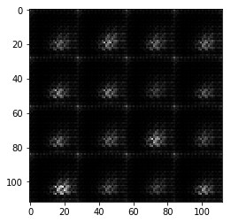


    Epoch 1/2... batches 110 Discriminator Loss: 0.1087... Generator Loss: 4.3793
    Epoch 1/2... batches 120 Discriminator Loss: 0.2263... Generator Loss: 3.6941
    Epoch 1/2... batches 130 Discriminator Loss: 0.1380... Generator Loss: 2.8095
    Epoch 1/2... batches 140 Discriminator Loss: 0.0907... Generator Loss: 6.2274
    Epoch 1/2... batches 150 Discriminator Loss: 0.1387... Generator Loss: 2.7473
    Epoch 1/2... batches 160 Discriminator Loss: 0.1312... Generator Loss: 2.8720
    Epoch 1/2... batches 170 Discriminator Loss: 0.1093... Generator Loss: 6.2545
    Epoch 1/2... batches 180 Discriminator Loss: 0.1135... Generator Loss: 3.6440
    Epoch 1/2... batches 190 Discriminator Loss: 0.1318... Generator Loss: 3.2056
    Epoch 1/2... batches 200 Discriminator Loss: 0.1011... Generator Loss: 3.4645


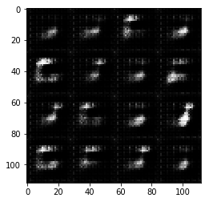


    Epoch 1/2... batches 210 Discriminator Loss: 0.2158... Generator Loss: 2.7231
    Epoch 1/2... batches 220 Discriminator Loss: 0.5306... Generator Loss: 7.4019
    Epoch 1/2... batches 230 Discriminator Loss: 0.3271... Generator Loss: 3.6439
    Epoch 1/2... batches 240 Discriminator Loss: 0.3998... Generator Loss: 2.0192
    Epoch 1/2... batches 250 Discriminator Loss: 0.5083... Generator Loss: 4.2669
    Epoch 1/2... batches 260 Discriminator Loss: 0.3402... Generator Loss: 2.3249
    Epoch 1/2... batches 270 Discriminator Loss: 0.7192... Generator Loss: 1.0663
    Epoch 1/2... batches 280 Discriminator Loss: 0.3814... Generator Loss: 1.9189
    Epoch 1/2... batches 290 Discriminator Loss: 0.2891... Generator Loss: 3.8142
    Epoch 1/2... batches 300 Discriminator Loss: 0.4899... Generator Loss: 1.9529


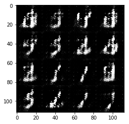


    Epoch 1/2... batches 310 Discriminator Loss: 0.4176... Generator Loss: 1.6531
    Epoch 1/2... batches 320 Discriminator Loss: 0.3426... Generator Loss: 3.2696
    Epoch 1/2... batches 330 Discriminator Loss: 0.9231... Generator Loss: 0.9247
    Epoch 1/2... batches 340 Discriminator Loss: 0.5341... Generator Loss: 1.7514
    Epoch 1/2... batches 350 Discriminator Loss: 0.8068... Generator Loss: 2.2795
    Epoch 1/2... batches 360 Discriminator Loss: 0.4512... Generator Loss: 2.1573
    Epoch 1/2... batches 370 Discriminator Loss: 0.5802... Generator Loss: 2.6110
    Epoch 1/2... batches 380 Discriminator Loss: 0.7108... Generator Loss: 1.2145
    Epoch 1/2... batches 390 Discriminator Loss: 0.6806... Generator Loss: 1.6886
    Epoch 1/2... batches 400 Discriminator Loss: 0.7188... Generator Loss: 1.7322


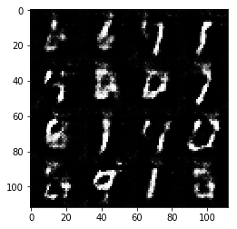


    Epoch 1/2... batches 410 Discriminator Loss: 0.6418... Generator Loss: 1.4164
    Epoch 1/2... batches 420 Discriminator Loss: 0.8744... Generator Loss: 1.3218
    Epoch 1/2... batches 430 Discriminator Loss: 0.7727... Generator Loss: 1.8496
    Epoch 1/2... batches 440 Discriminator Loss: 0.8927... Generator Loss: 1.7759
    Epoch 1/2... batches 450 Discriminator Loss: 0.9466... Generator Loss: 0.8000
    Epoch 1/2... batches 460 Discriminator Loss: 1.1789... Generator Loss: 0.5400
    Epoch 2/2... batches 470 Discriminator Loss: 0.9096... Generator Loss: 2.0733
    Epoch 2/2... batches 480 Discriminator Loss: 1.0463... Generator Loss: 0.7486
    Epoch 2/2... batches 490 Discriminator Loss: 0.8463... Generator Loss: 1.0571
    Epoch 2/2... batches 500 Discriminator Loss: 1.0127... Generator Loss: 2.0145


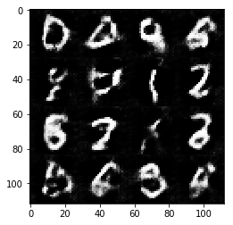


    Epoch 2/2... batches 510 Discriminator Loss: 0.8507... Generator Loss: 1.2965
    Epoch 2/2... batches 520 Discriminator Loss: 1.0265... Generator Loss: 1.8758
    Epoch 2/2... batches 530 Discriminator Loss: 0.7723... Generator Loss: 1.3352
    Epoch 2/2... batches 540 Discriminator Loss: 0.9489... Generator Loss: 0.9894
    Epoch 2/2... batches 550 Discriminator Loss: 0.9997... Generator Loss: 0.9696
    Epoch 2/2... batches 560 Discriminator Loss: 1.0265... Generator Loss: 0.7173
    Epoch 2/2... batches 570 Discriminator Loss: 1.0477... Generator Loss: 1.6797
    Epoch 2/2... batches 580 Discriminator Loss: 1.3011... Generator Loss: 0.4387
    Epoch 2/2... batches 590 Discriminator Loss: 0.9739... Generator Loss: 1.1902
    Epoch 2/2... batches 600 Discriminator Loss: 1.1241... Generator Loss: 0.6267


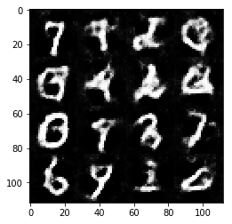


    Epoch 2/2... batches 610 Discriminator Loss: 0.9809... Generator Loss: 1.5478
    Epoch 2/2... batches 620 Discriminator Loss: 1.3309... Generator Loss: 0.4548
    Epoch 2/2... batches 630 Discriminator Loss: 0.9793... Generator Loss: 0.8886
    Epoch 2/2... batches 640 Discriminator Loss: 0.9952... Generator Loss: 1.3401
    Epoch 2/2... batches 650 Discriminator Loss: 0.9416... Generator Loss: 1.0926
    Epoch 2/2... batches 660 Discriminator Loss: 1.4696... Generator Loss: 0.3572
    Epoch 2/2... batches 670 Discriminator Loss: 0.9984... Generator Loss: 0.7289
    Epoch 2/2... batches 680 Discriminator Loss: 1.7230... Generator Loss: 0.2494
    Epoch 2/2... batches 690 Discriminator Loss: 0.9356... Generator Loss: 1.1155
    Epoch 2/2... batches 700 Discriminator Loss: 1.0814... Generator Loss: 0.9623


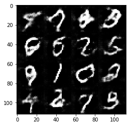


    Epoch 2/2... batches 710 Discriminator Loss: 1.1104... Generator Loss: 1.5504
    Epoch 2/2... batches 720 Discriminator Loss: 1.0304... Generator Loss: 0.8694
    Epoch 2/2... batches 730 Discriminator Loss: 0.9826... Generator Loss: 0.8873
    Epoch 2/2... batches 740 Discriminator Loss: 0.9677... Generator Loss: 1.0830
    Epoch 2/2... batches 750 Discriminator Loss: 1.1163... Generator Loss: 0.6243
    Epoch 2/2... batches 760 Discriminator Loss: 1.0493... Generator Loss: 0.7179
    Epoch 2/2... batches 770 Discriminator Loss: 1.0474... Generator Loss: 1.4284
    Epoch 2/2... batches 780 Discriminator Loss: 1.0310... Generator Loss: 0.8437
    Epoch 2/2... batches 790 Discriminator Loss: 1.2204... Generator Loss: 0.5582
    Epoch 2/2... batches 800 Discriminator Loss: 1.0373... Generator Loss: 0.8205


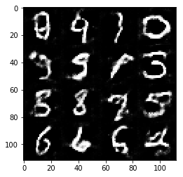


    Epoch 2/2... batches 810 Discriminator Loss: 1.8518... Generator Loss: 0.2160
    Epoch 2/2... batches 820 Discriminator Loss: 1.0556... Generator Loss: 0.7013
    Epoch 2/2... batches 830 Discriminator Loss: 0.9958... Generator Loss: 0.8435
    Epoch 2/2... batches 840 Discriminator Loss: 1.0539... Generator Loss: 0.9333
    Epoch 2/2... batches 850 Discriminator Loss: 1.1626... Generator Loss: 0.5796
    Epoch 2/2... batches 860 Discriminator Loss: 0.9677... Generator Loss: 1.3110
    Epoch 2/2... batches 870 Discriminator Loss: 0.9544... Generator Loss: 1.1345
    Epoch 2/2... batches 880 Discriminator Loss: 1.0089... Generator Loss: 0.9970
    Epoch 2/2... batches 890 Discriminator Loss: 1.5367... Generator Loss: 0.3098
    Epoch 2/2... batches 900 Discriminator Loss: 0.9795... Generator Loss: 1.1629


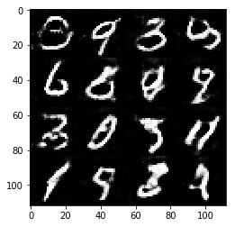


    Epoch 2/2... batches 910 Discriminator Loss: 1.3527... Generator Loss: 0.4008
    Epoch 2/2... batches 920 Discriminator Loss: 0.9611... Generator Loss: 0.8051
    Epoch 2/2... batches 930 Discriminator Loss: 1.3405... Generator Loss: 2.0095


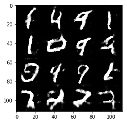


```python
plot_losses(d_losses, g_losses)
```


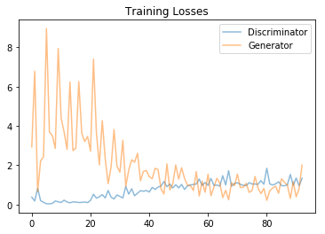


### CelebA
Run your GANs on CelebA.  It will take around 20 minutes on the average GPU to run one epoch.  You can run the whole epoch or stop when it starts to generate realistic faces.


```python
batch_size = 128
z_dim = 100
learning_rate = 0.0002
beta1 = 0.5
d_losses = []
g_losses = []


"""
DON'T MODIFY ANYTHING IN THIS CELL THAT IS BELOW THIS LINE
"""
epochs = 1

celeba_dataset = helper.Dataset('celeba', glob(os.path.join(data_dir, 'img_align_celeba/*.jpg')))

with tf.Graph().as_default():
    d_losses, g_losses = train(epochs, batch_size, z_dim, learning_rate, beta1, celeba_dataset.get_batches,
          celeba_dataset.shape, celeba_dataset.image_mode)
```

    Epoch 1/1... batches 10 Discriminator Loss: 0.6152... Generator Loss: 1.8326
    Epoch 1/1... batches 20 Discriminator Loss: 0.4201... Generator Loss: 2.4794
    Epoch 1/1... batches 30 Discriminator Loss: 0.2704... Generator Loss: 2.7535
    Epoch 1/1... batches 40 Discriminator Loss: 0.4224... Generator Loss: 8.2014
    Epoch 1/1... batches 50 Discriminator Loss: 0.4800... Generator Loss: 1.1211
    Epoch 1/1... batches 60 Discriminator Loss: 0.3885... Generator Loss: 2.2742
    Epoch 1/1... batches 70 Discriminator Loss: 0.2367... Generator Loss: 5.4312
    Epoch 1/1... batches 80 Discriminator Loss: 0.2688... Generator Loss: 7.4432
    Epoch 1/1... batches 90 Discriminator Loss: 0.4155... Generator Loss: 4.5610
    Epoch 1/1... batches 100 Discriminator Loss: 0.3140... Generator Loss: 3.6987


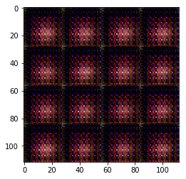


    Epoch 1/1... batches 110 Discriminator Loss: 0.4462... Generator Loss: 1.6862
    Epoch 1/1... batches 120 Discriminator Loss: 0.2709... Generator Loss: 2.0114
    Epoch 1/1... batches 130 Discriminator Loss: 0.3162... Generator Loss: 2.2819
    Epoch 1/1... batches 140 Discriminator Loss: 0.5720... Generator Loss: 5.5706
    Epoch 1/1... batches 150 Discriminator Loss: 0.3044... Generator Loss: 1.7754
    Epoch 1/1... batches 160 Discriminator Loss: 0.2454... Generator Loss: 2.1520
    Epoch 1/1... batches 170 Discriminator Loss: 0.3000... Generator Loss: 2.4096
    Epoch 1/1... batches 180 Discriminator Loss: 0.1448... Generator Loss: 3.0233
    Epoch 1/1... batches 190 Discriminator Loss: 0.2264... Generator Loss: 2.4638
    Epoch 1/1... batches 200 Discriminator Loss: 0.1753... Generator Loss: 2.9213


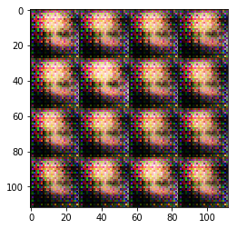


    Epoch 1/1... batches 210 Discriminator Loss: 0.2482... Generator Loss: 2.3480
    Epoch 1/1... batches 220 Discriminator Loss: 0.1951... Generator Loss: 2.7090
    Epoch 1/1... batches 230 Discriminator Loss: 1.0119... Generator Loss: 0.6355
    Epoch 1/1... batches 240 Discriminator Loss: 0.9863... Generator Loss: 1.1025
    Epoch 1/1... batches 250 Discriminator Loss: 0.6071... Generator Loss: 1.2330
    Epoch 1/1... batches 260 Discriminator Loss: 0.4227... Generator Loss: 2.0244
    Epoch 1/1... batches 270 Discriminator Loss: 0.6592... Generator Loss: 1.0016
    Epoch 1/1... batches 280 Discriminator Loss: 0.3652... Generator Loss: 2.1127
    Epoch 1/1... batches 290 Discriminator Loss: 0.4600... Generator Loss: 1.7253
    Epoch 1/1... batches 300 Discriminator Loss: 0.3980... Generator Loss: 1.7951


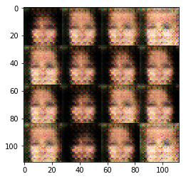


    Epoch 1/1... batches 310 Discriminator Loss: 0.3298... Generator Loss: 1.6850
    Epoch 1/1... batches 320 Discriminator Loss: 1.0530... Generator Loss: 0.6656
    Epoch 1/1... batches 330 Discriminator Loss: 0.2890... Generator Loss: 2.1807
    Epoch 1/1... batches 340 Discriminator Loss: 0.5161... Generator Loss: 1.8959
    Epoch 1/1... batches 350 Discriminator Loss: 0.7598... Generator Loss: 1.8098
    Epoch 1/1... batches 360 Discriminator Loss: 1.2477... Generator Loss: 0.8372
    Epoch 1/1... batches 370 Discriminator Loss: 1.1459... Generator Loss: 1.4148
    Epoch 1/1... batches 380 Discriminator Loss: 1.9528... Generator Loss: 0.2312
    Epoch 1/1... batches 390 Discriminator Loss: 0.6834... Generator Loss: 1.5520
    Epoch 1/1... batches 400 Discriminator Loss: 0.7086... Generator Loss: 2.1163


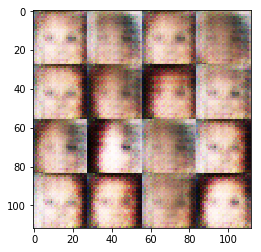


    Epoch 1/1... batches 410 Discriminator Loss: 0.4609... Generator Loss: 2.5409
    Epoch 1/1... batches 420 Discriminator Loss: 0.7689... Generator Loss: 1.3522
    Epoch 1/1... batches 430 Discriminator Loss: 0.9456... Generator Loss: 0.8088
    Epoch 1/1... batches 440 Discriminator Loss: 0.6473... Generator Loss: 2.1241
    Epoch 1/1... batches 450 Discriminator Loss: 0.8650... Generator Loss: 2.0485
    Epoch 1/1... batches 460 Discriminator Loss: 0.7475... Generator Loss: 1.3580
    Epoch 1/1... batches 470 Discriminator Loss: 0.6781... Generator Loss: 1.8326
    Epoch 1/1... batches 480 Discriminator Loss: 0.6525... Generator Loss: 1.6932
    Epoch 1/1... batches 490 Discriminator Loss: 0.6949... Generator Loss: 1.1260
    Epoch 1/1... batches 500 Discriminator Loss: 1.0259... Generator Loss: 0.9092


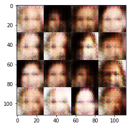


    Epoch 1/1... batches 510 Discriminator Loss: 0.7019... Generator Loss: 1.3978
    Epoch 1/1... batches 520 Discriminator Loss: 0.6689... Generator Loss: 1.4106
    Epoch 1/1... batches 530 Discriminator Loss: 0.5450... Generator Loss: 2.0689
    Epoch 1/1... batches 540 Discriminator Loss: 1.1253... Generator Loss: 3.4332
    Epoch 1/1... batches 550 Discriminator Loss: 0.7823... Generator Loss: 3.2404
    Epoch 1/1... batches 560 Discriminator Loss: 0.7555... Generator Loss: 1.4631
    Epoch 1/1... batches 570 Discriminator Loss: 0.6074... Generator Loss: 1.7708
    Epoch 1/1... batches 580 Discriminator Loss: 0.7569... Generator Loss: 1.1800
    Epoch 1/1... batches 590 Discriminator Loss: 0.6245... Generator Loss: 1.2657
    Epoch 1/1... batches 600 Discriminator Loss: 0.5926... Generator Loss: 1.2459


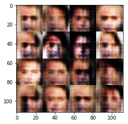


    Epoch 1/1... batches 610 Discriminator Loss: 0.7351... Generator Loss: 1.7746
    Epoch 1/1... batches 620 Discriminator Loss: 0.9052... Generator Loss: 0.8657
    Epoch 1/1... batches 630 Discriminator Loss: 0.7116... Generator Loss: 2.2758
    Epoch 1/1... batches 640 Discriminator Loss: 0.4990... Generator Loss: 1.5992
    Epoch 1/1... batches 650 Discriminator Loss: 0.4867... Generator Loss: 1.5099
    Epoch 1/1... batches 660 Discriminator Loss: 0.8315... Generator Loss: 2.5120
    Epoch 1/1... batches 670 Discriminator Loss: 1.0672... Generator Loss: 0.6385
    Epoch 1/1... batches 680 Discriminator Loss: 0.3974... Generator Loss: 3.7591
    Epoch 1/1... batches 690 Discriminator Loss: 0.4091... Generator Loss: 1.5119
    Epoch 1/1... batches 700 Discriminator Loss: 1.5752... Generator Loss: 0.3449


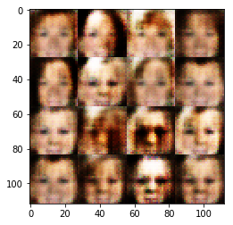


    Epoch 1/1... batches 710 Discriminator Loss: 2.5715... Generator Loss: 0.1412
    Epoch 1/1... batches 720 Discriminator Loss: 0.5212... Generator Loss: 1.8983
    Epoch 1/1... batches 730 Discriminator Loss: 0.6141... Generator Loss: 1.2141
    Epoch 1/1... batches 740 Discriminator Loss: 0.3371... Generator Loss: 5.0129
    Epoch 1/1... batches 750 Discriminator Loss: 0.9042... Generator Loss: 2.8002
    Epoch 1/1... batches 760 Discriminator Loss: 1.1321... Generator Loss: 0.6137
    Epoch 1/1... batches 770 Discriminator Loss: 0.6544... Generator Loss: 1.1529
    Epoch 1/1... batches 780 Discriminator Loss: 2.3764... Generator Loss: 0.1589
    Epoch 1/1... batches 790 Discriminator Loss: 0.7767... Generator Loss: 1.6728
    Epoch 1/1... batches 800 Discriminator Loss: 0.9823... Generator Loss: 0.7274


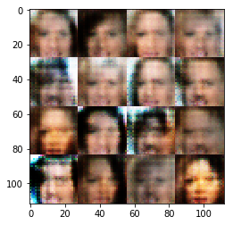


    Epoch 1/1... batches 810 Discriminator Loss: 0.9290... Generator Loss: 0.9039
    Epoch 1/1... batches 820 Discriminator Loss: 1.0732... Generator Loss: 0.7181
    Epoch 1/1... batches 830 Discriminator Loss: 0.9068... Generator Loss: 0.7565
    Epoch 1/1... batches 840 Discriminator Loss: 0.6397... Generator Loss: 1.5679
    Epoch 1/1... batches 850 Discriminator Loss: 1.2781... Generator Loss: 0.5859
    Epoch 1/1... batches 860 Discriminator Loss: 1.0601... Generator Loss: 0.7487
    Epoch 1/1... batches 870 Discriminator Loss: 0.6801... Generator Loss: 1.3639
    Epoch 1/1... batches 880 Discriminator Loss: 0.4790... Generator Loss: 3.6404
    Epoch 1/1... batches 890 Discriminator Loss: 0.4523... Generator Loss: 1.9876
    Epoch 1/1... batches 900 Discriminator Loss: 0.3990... Generator Loss: 2.0363


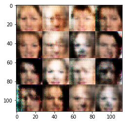


    Epoch 1/1... batches 910 Discriminator Loss: 0.8815... Generator Loss: 1.0735
    Epoch 1/1... batches 920 Discriminator Loss: 0.7415... Generator Loss: 1.5601
    Epoch 1/1... batches 930 Discriminator Loss: 0.9131... Generator Loss: 1.9417
    Epoch 1/1... batches 940 Discriminator Loss: 1.1389... Generator Loss: 1.6963
    Epoch 1/1... batches 950 Discriminator Loss: 1.2190... Generator Loss: 1.9793
    Epoch 1/1... batches 960 Discriminator Loss: 1.6288... Generator Loss: 0.4321
    Epoch 1/1... batches 970 Discriminator Loss: 1.1425... Generator Loss: 0.5867
    Epoch 1/1... batches 980 Discriminator Loss: 0.9134... Generator Loss: 1.0178
    Epoch 1/1... batches 990 Discriminator Loss: 1.1356... Generator Loss: 0.9511
    Epoch 1/1... batches 1000 Discriminator Loss: 1.1666... Generator Loss: 0.8311


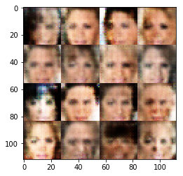


    Epoch 1/1... batches 1010 Discriminator Loss: 0.9872... Generator Loss: 1.0298
    Epoch 1/1... batches 1020 Discriminator Loss: 0.7666... Generator Loss: 1.6680
    Epoch 1/1... batches 1030 Discriminator Loss: 1.0094... Generator Loss: 2.5982
    Epoch 1/1... batches 1040 Discriminator Loss: 0.6574... Generator Loss: 1.3589
    Epoch 1/1... batches 1050 Discriminator Loss: 0.8702... Generator Loss: 3.0270
    Epoch 1/1... batches 1060 Discriminator Loss: 0.8804... Generator Loss: 1.0300
    Epoch 1/1... batches 1070 Discriminator Loss: 0.8758... Generator Loss: 3.9702
    Epoch 1/1... batches 1080 Discriminator Loss: 0.6716... Generator Loss: 1.4000
    Epoch 1/1... batches 1090 Discriminator Loss: 0.9497... Generator Loss: 0.8051
    Epoch 1/1... batches 1100 Discriminator Loss: 0.7768... Generator Loss: 1.4795


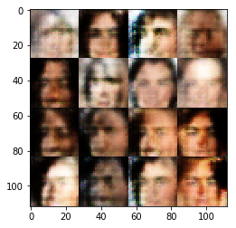


    Epoch 1/1... batches 1110 Discriminator Loss: 0.8621... Generator Loss: 1.7675
    Epoch 1/1... batches 1120 Discriminator Loss: 0.7977... Generator Loss: 1.0077
    Epoch 1/1... batches 1130 Discriminator Loss: 0.6976... Generator Loss: 1.4693
    Epoch 1/1... batches 1140 Discriminator Loss: 1.2554... Generator Loss: 0.6227
    Epoch 1/1... batches 1150 Discriminator Loss: 0.9013... Generator Loss: 0.9110
    Epoch 1/1... batches 1160 Discriminator Loss: 0.9905... Generator Loss: 1.1356
    Epoch 1/1... batches 1170 Discriminator Loss: 1.3333... Generator Loss: 0.5038
    Epoch 1/1... batches 1180 Discriminator Loss: 1.4216... Generator Loss: 2.6967
    Epoch 1/1... batches 1190 Discriminator Loss: 1.3509... Generator Loss: 2.0896
    Epoch 1/1... batches 1200 Discriminator Loss: 1.3240... Generator Loss: 0.4760


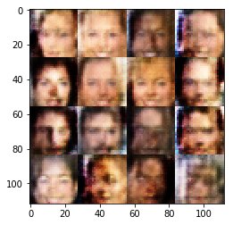


    Epoch 1/1... batches 1210 Discriminator Loss: 0.7466... Generator Loss: 1.1471
    Epoch 1/1... batches 1220 Discriminator Loss: 0.9082... Generator Loss: 1.1408
    Epoch 1/1... batches 1230 Discriminator Loss: 1.0254... Generator Loss: 0.8986
    Epoch 1/1... batches 1240 Discriminator Loss: 1.1573... Generator Loss: 0.7163
    Epoch 1/1... batches 1250 Discriminator Loss: 1.0717... Generator Loss: 1.0171
    Epoch 1/1... batches 1260 Discriminator Loss: 1.3228... Generator Loss: 0.4798
    Epoch 1/1... batches 1270 Discriminator Loss: 0.8125... Generator Loss: 0.9728
    Epoch 1/1... batches 1280 Discriminator Loss: 0.4645... Generator Loss: 1.7906
    Epoch 1/1... batches 1290 Discriminator Loss: 0.8608... Generator Loss: 1.1646
    Epoch 1/1... batches 1300 Discriminator Loss: 0.9202... Generator Loss: 1.0244


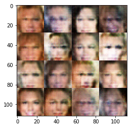


    Epoch 1/1... batches 1310 Discriminator Loss: 0.7738... Generator Loss: 1.8444
    Epoch 1/1... batches 1320 Discriminator Loss: 1.6293... Generator Loss: 0.3283
    Epoch 1/1... batches 1330 Discriminator Loss: 0.8235... Generator Loss: 1.2991
    Epoch 1/1... batches 1340 Discriminator Loss: 1.6004... Generator Loss: 0.3366
    Epoch 1/1... batches 1350 Discriminator Loss: 0.4178... Generator Loss: 2.7764
    Epoch 1/1... batches 1360 Discriminator Loss: 1.0603... Generator Loss: 0.8950
    Epoch 1/1... batches 1370 Discriminator Loss: 0.9382... Generator Loss: 1.2796
    Epoch 1/1... batches 1380 Discriminator Loss: 0.5536... Generator Loss: 1.9885
    Epoch 1/1... batches 1390 Discriminator Loss: 0.9169... Generator Loss: 1.7959
    Epoch 1/1... batches 1400 Discriminator Loss: 1.4907... Generator Loss: 0.4573


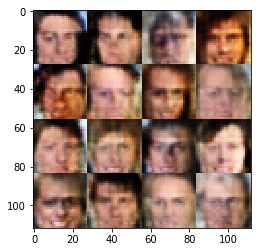


    Epoch 1/1... batches 1410 Discriminator Loss: 0.9375... Generator Loss: 1.0994
    Epoch 1/1... batches 1420 Discriminator Loss: 0.7708... Generator Loss: 1.2510
    Epoch 1/1... batches 1430 Discriminator Loss: 0.8641... Generator Loss: 1.9123
    Epoch 1/1... batches 1440 Discriminator Loss: 0.9547... Generator Loss: 1.3558
    Epoch 1/1... batches 1450 Discriminator Loss: 1.1396... Generator Loss: 0.7504
    Epoch 1/1... batches 1460 Discriminator Loss: 0.9772... Generator Loss: 1.1512
    Epoch 1/1... batches 1470 Discriminator Loss: 1.1929... Generator Loss: 1.3384
    Epoch 1/1... batches 1480 Discriminator Loss: 1.0589... Generator Loss: 1.0047
    Epoch 1/1... batches 1490 Discriminator Loss: 1.0686... Generator Loss: 1.0405
    Epoch 1/1... batches 1500 Discriminator Loss: 0.8254... Generator Loss: 1.2210


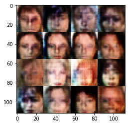


    Epoch 1/1... batches 1510 Discriminator Loss: 0.7512... Generator Loss: 1.7003
    Epoch 1/1... batches 1520 Discriminator Loss: 1.0686... Generator Loss: 1.4538
    Epoch 1/1... batches 1530 Discriminator Loss: 1.3033... Generator Loss: 0.4967
    Epoch 1/1... batches 1540 Discriminator Loss: 1.1417... Generator Loss: 0.5670
    Epoch 1/1... batches 1550 Discriminator Loss: 0.5577... Generator Loss: 2.4422
    Epoch 1/1... batches 1560 Discriminator Loss: 1.1981... Generator Loss: 0.6079
    Epoch 1/1... batches 1570 Discriminator Loss: 0.7482... Generator Loss: 1.1172
    Epoch 1/1... batches 1580 Discriminator Loss: 0.6642... Generator Loss: 2.4025


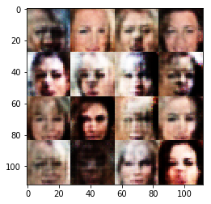


```python
plot_losses(d_losses, g_losses)
```


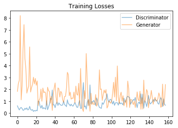


### Submitting This Project
When submitting this project, make sure to run all the cells before saving the notebook. Save the notebook file as "dlnd_face_generation.ipynb" and save it as a HTML file under "File" -> "Download as". Include the "helper.py" and "problem_unittests.py" files in your submission.
